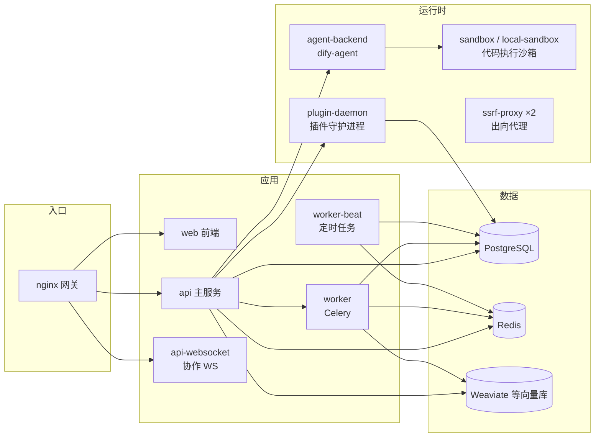

# edify 项目说明

> 面向新成员的架构总览与上手指引。读完本文应能回答：这个仓库是什么、有哪些功能模块、
> 代码放在哪、本地怎么跑起来、部署到哪里。

## 1. 项目简介

**edify 是 Dify（开源 LLM 应用开发平台）的内部 fork**，基于上游 **1.16.1** 版本
（镜像 tag 约定 `1.16.1-edify`），部署产品名为 **lomva**，运行在腾讯云 TKE 上，
QA 环境入口为 `https://qa-xai.xingshulin.com/lomva`。

平台核心能力（继承自上游 Dify）：

- **应用编排**：聊天助手 / Agent / 文本生成 / 工作流 / Chatflow 等应用类型
- **工作流引擎**：可视化 DAG 编排，支持节点、连线、变量、人工输入、多人协作
- **Agent**：ReAct / Function Calling 等推理策略，另有独立的新一代 Agent 后端（`dify-agent/`）
- **RAG 知识库**：文档提取、清洗、切分、嵌入、索引、检索、重排全链路
- **插件系统**：模型 / 工具 / 端点 / Agent 插件，由独立 plugin-daemon 承载
- **工具与集成**：内置工具、自定义工具、MCP（Model Context Protocol）、Webhook/定时触发器

**与上游 Dify 的关系**：应用源码层基本沿用上游（`api/`、`web/` 内仍是 Dify 品牌，
便于跟进上游合并）；定制集中在**部署层**（`k8s/` 清单、`lomva-*` 镜像、CI 工作流）
和少量后端行为调整，详见 [5.3 fork 定制点](#53-fork-定制点)。

## 2. 仓库总览

monorepo，后端用 uv 管理，前端用 pnpm workspace：

| 目录 | 职责 | 技术栈 |
|---|---|---|
| `api/` | 后端主服务（控制台 API、应用运行时、RAG、工作流引擎） | Python 3.12 · Flask + flask-restx · SQLAlchemy · Celery · uv |
| `web/` | 前端控制台与分享端 WebApp | Next.js 16 (App Router) · React 19 · TypeScript · Tailwind 4 · pnpm |
| `dify-agent/` | 独立 Agent 后端（新一代 Agent 能力） | Python 3.12 · pydantic-ai · FastAPI |
| `dify-agent-runtime/` | Agent 作业执行运行时（shellctl 服务端、Landlock 沙箱） | Go 1.26 · cobra |
| `cli/` | 命令行客户端 `difyctl`（登录、运行应用、安装 SKILL.md） | TypeScript · Bun · oRPC |
| `e2e/` | 端到端测试套件（含 WCAG 可访问性扫描） | Cucumber · Playwright |
| `sdks/` | 对外 API 客户端 SDK | Node.js (TS) · PHP |
| `packages/` | pnpm workspace 共享包（UI、契约、代理等） | TypeScript |
| `docker/` | Docker Compose 部署资产 | docker-compose · envs 分主题拆分 |
| `k8s/` | K8s / TKE 部署清单（**本 fork 新增**） | Kustomize（base + overlays） |
| `dev/` | 本地开发辅助脚本（setup、start-api/web/worker…） | Bash |
| `scripts/` | 仓库级质量门禁与压测脚本 | Python · Node · Locust |
| `docs/` | 多语言 README、运维文档（postmortems、跨环境迁移） | Markdown |
| `.github/` | CI/CD 工作流 | GitHub Actions |

各子目录根部一般有自己的 `AGENTS.md`（`CLAUDE.md` 软链到它），改某个区域前先读对应那份。

## 3. 功能模块详解

### 3.1 后端 `api/`

**技术栈**：Flask 3 + flask-restx（REST）、SQLAlchemy + Alembic（ORM/迁移）、
PostgreSQL + Redis、Celery 5（异步/定时任务）、Gunicorn + gevent、
python-socketio（WebSocket 协作）、Pydantic v2（配置与校验）、OpenTelemetry（埋点）。
包管理用 **uv**，后端命令统一通过 `uv run --project api <command>` 执行；
集成测试只在 CI 跑，本地不要求。

**分层结构**：

```
controllers/  HTTP 接口层（按调用方分命名空间，见下表）
services/     应用服务层（编排核心逻辑，供 controllers 调用）
core/         核心领域逻辑（工作流、RAG、Agent、插件、模型……）
models/       SQLAlchemy 数据模型
repositories/ 工作流运行/节点执行等读写仓库
tasks/        Celery 异步任务        schedule/  Celery Beat 定时任务
extensions/   Flask 扩展初始化（DB/Redis/Celery/登录/存储/OTel）
configs/      Pydantic 分层配置      commands/   Flask CLI 命令
migrations/   Alembic 迁移脚本       events/     领域事件处理器
providers/    uv workspace 插件（vdb/* 向量库、trace/* 追踪）
clients/      外部服务客户端（主要是 agent_backend）
tests/        单元测试与集成测试
```

**API 入口矩阵**（`controllers/` 下的命名空间）：

| 目录 | 前缀 | 调用方 |
|---|---|---|
| `console/` | `/console/api` | 管理控制台前端（Session + CSRF，面向开发者/管理员） |
| `web/` | `/api` | 公开分享 WebApp 与嵌入聊天页（面向终端用户） |
| `service_api/` | `/v1` | 应用级服务 API（App/Dataset/EndUser，供业务方集成） |
| `openapi/` | `/openapi/v1` | 用户级程序化 API（Bearer Token，供 difyctl/第三方） |
| `inner_api/` | `/inner/api` | 内部服务（plugin-daemon、Agent 后端、企业计费等） |
| `files/` | `/files` | 文件上传/预览，插件数据面 |
| `mcp/` | `/mcp` | MCP 协议入口 |
| `trigger/` | `/triggers` | Webhook / 定时触发器回调 |

**核心域**（`core/` 下常用模块）：

- `core/app/` — 应用运行时核心：App 配置（EasyUI/WorkflowUI）、各类型 App 生成器（Chat/Agent/Completion/Workflow/Pipeline）
- `core/workflow/` — 工作流引擎：DSL 节点定义、节点实现、执行生成器
- `core/agent/` — Agent 执行引擎（ReAct、Function Calling、策略与输出解析）
- `core/rag/` — RAG 全链路：提取、清洗、切分、嵌入、索引、检索、重排、向量库抽象
- `core/plugin/` — 插件系统：与 plugin-daemon 通信、模型/工具/端点插件实现、反向调用
- `core/tools/` — 工具系统：内置/自定义/插件/MCP/Workflow-as-tool
- `core/mcp/`、`core/trigger/` — MCP 客户端/服务端；触发器运行时
- `provider_manager.py` + `model_manager.py` — 模型供应商配置与模型实例管理
- `core/moderation/`、`core/memory/`、`core/datasource/`、`core/rbac/` — 内容审核、记忆、数据源、权限

### 3.2 前端 `web/`

**技术栈**：Next.js 16（App Router + RSC）+ React 19 + TypeScript；
状态管理 Jotai / Zustand / TanStack Query（URL 状态用 nuqs）；
样式 Tailwind CSS 4 + `@langgenius/dify-ui` 设计系统；
API 层为 `@orpc` 生成型客户端（契约来自 `packages/contracts`）+ 少量 legacy REST 封装；
测试 Vitest + React Testing Library + Playwright，组件文档 Storybook。

**路由分区**（`web/app/`）：

| 路由组 | 场景 |
|---|---|
| `(commonLayout)` | 登录后主控制台：应用列表 `/apps`、应用编排 `/app/[appId]`、知识库 `/datasets`、插件 `/plugins`、工具 `/tools`、探索 `/explore` 等 |
| `(shareLayout)` | 面向终端用户的分享 WebApp：`/chat/[token]`、`/agent/[token]`、`/workflow/[token]`、`/completion/[token]` |
| `(humanInputLayout)` | 人工输入表单 `/form/[token]`（工作流人工节点） |
| `install/` `init/` | 管理员初始化 / 安装引导 |
| `signin/` `signup/` `account/` 等 | 认证与账号生命周期 |

**组件分组**（`web/app/components/`，选主要的）：

- `workflow/` `workflow-app/` — 工作流编辑器（React Flow 画布、节点、运行、多人协作、变量检查）
- `datasets/` — 知识库全流程（创建、文档、分段、命中测试、元数据、外部知识 API）
- `plugins/` — 插件中心（市场、安装、认证、详情）
- `tools/` — 工具管理（自定义集合、MCP、Provider、workflow-tool）
- `app/` `apps/` — 应用编排面板、发布器、日志、标注；应用列表
- `base/` — 基础 UI 组件库（Chat、Markdown、FileUploader 等）
- `billing/`、`explore/`、`develop/`、`snippets/`、`rag-pipeline/` — 计费、应用市场、开发者设置、片段、RAG 流水线编辑器
- `goto-anything/` — 全局命令面板

**service 层**：`service/client.ts` 基于 `@dify/contracts` 生成 `consoleClient`（对应后端
`controllers/console/*`，自动类型 + 缓存失效）；`service/base.ts`/`fetch.ts` 是底层封装
（CSRF、token 刷新、SSE 流）；分享端走 `controllers/web/*` 与 `service_api/*`。

### 3.3 Agent 后端 `dify-agent/` + 运行时 `dify-agent-runtime/`

- **`dify-agent/`**（Python 3.12，pydantic-ai）：独立 Agent 后端，承载新一代 Agent 能力。
  内含 `agenton`（Agent 编排框架）、`dify_agent`（业务后端/协议/运行时适配）、
  `shellctl`（远端 shell 控制协议）等包；主后端通过 `api/clients/agent_backend` 与其交互。
- **`dify-agent-runtime/`**（Go）：配套运行时，实现 `shellctl serve`、命令 runner、
  tmux PTY 处理、SQLite 退出记录，并用 **Landlock** 对每个 Agent 作业做路径级沙箱隔离。

### 3.4 CLI `cli/`

`difyctl`（TypeScript/Bun）：面向平台的命令行客户端。支持浏览器 device-flow 登录、
列出/查看应用、阻塞或流式运行应用（JSON/YAML/文本输出），还可把 `SKILL.md` 一键安装到
本地 Agent（Claude Code、Codex、Cursor 等）。兼容 Dify 1.16.0–1.16.1。

### 3.5 E2E `e2e/`

仓库级端到端测试：Cucumber 写场景、Playwright 驱动浏览器，覆盖 Web 功能、
Agent 后端运行时、多角色跨身份流程，并用 axe-core 做 WCAG A/AA 可访问性扫描。
含 seed/fixture 机制与多 profile（prepared / external-runtime / post-merge）。

### 3.6 SDK `sdks/` 与共享包 `packages/`

- `sdks/nodejs-client`（`dify-client`，TS/ESM）与 `sdks/php-client`（PHP ≥ 7.2）：
  供外部应用集成 Chat/Completion/Workflow/Knowledge Base API。
- `packages/`（pnpm workspace，供 web/cli/e2e 消费）：
  - `@langgenius/dify-ui` — 共享 UI 原语与设计 token（Tailwind 4）
  - `@dify/contracts` — 由后端 OpenAPI/oRPC 生成的 TS 契约
  - `@langgenius/dev-proxy` — 本地开发代理（路由转发、CORS、Cookie 重写）
  - 另有 `@dify/iconify-collections`、`jotai-tanstack-form`、`@dify/tsconfig` 等

## 4. 运行时架构

部署组件与 `docker/docker-compose.yaml` 默认组件集一致：



| 组件 | 角色 |
|---|---|
| `nginx` | 唯一入口，反代 web / api / api-websocket |
| `api` | 主后端：控制台 API、应用运行时、RAG、工作流 |
| `api-websocket` | 工作流多人协作的 WebSocket（socket.io） |
| `worker` / `worker-beat` | Celery 异步任务 / 定时任务（知识库索引、清理、触发器等） |
| `web` | Next.js 前端 |
| `agent-backend` | 独立 Agent 后端（`dify-agent/`） |
| `plugin-daemon` | 插件守护进程（上游镜像 `langgenius/dify-plugin-daemon`） |
| `sandbox` / `local-sandbox` | 代码执行沙箱（上游 `dify-sandbox` / 本仓库 Go 运行时） |
| `ssrf-proxy` ×2 | 出向请求代理（防 SSRF，squid） |
| `init-permissions` | 一次性 Job，初始化权限数据 |

## 5. 部署与运维

### 5.1 Docker Compose（`docker/`）

`docker-compose.yaml` 为自动生成文件，包含全部组件与 20 余种可选向量库（默认 Weaviate）。
环境变量组织：`docker/.env` 是本地入口（只放默认启动必需项），可选/供应商专属配置放
`docker/envs/*.env`（按 core-services / databases / infrastructure / vectorstores 分主题，
后加载、优先级更高）。

### 5.2 K8s / TKE（`k8s/`，本 fork 新增）

基于 **Kustomize**（kubectl ≥ 1.27 内置），部署到腾讯云 TKE，**子路径**挂在共享域名下：

- `base/` — 全部工作负载（不含 Namespace 与 PG），所有资源带 `lomva-` 前缀
- `components/incluster-postgres/` — 可选的集群内 PG
- `overlays/subpath/` — `/lomva` 子路径中间层（nginx 路由改写 + 探针修正），不直接部署
- `overlays/qa/` — 测试环境：`qa-xai.xingshulin.com/lomva`，命名空间 `qa-ai-lomva`，外部自建 PG
- `overlays/prod/` — 线上环境：命名空间 `prod-ai-lomva`，外部 TencentDB PG（域名为占位符）
- `overlays/local/` — 本地 kind 验证（集群内 PG，命名空间 `qa-ai-lomva`）

关键约定：

- **镜像**：4 个自建（`lomva-api` / `lomva-web` / `lomva-agent-backend` / `lomva-agent-local-sandbox`）
  + 2 个复用上游（sandbox、plugin-daemon）。web 镜像必须带 `NEXT_PUBLIC_BASE_PATH=/lomva` 构建。
  构建推送：GitHub Actions `lomva-build-push.yml`（推 Docker Hub）或
  `k8s/scripts/build-images.sh`（本地构建推 TCR）。
- **部署**：`k8s/scripts/deploy.sh`（集群确认 → 机密预检 → dry-run → diff → rollout → 冒烟）。
- **机密**：`base/config/lomva-secret.env` 只放上游公开默认值（可入 git）；真实机密放
  `overlays/<env>/config/secret.env`（**已 gitignore**，由 `secret.env.example` 复制）。
- **存储**：6 个 PVC 走集群 StorageClass（TKE CBS 单盘最小 10Gi，RWO）；`lomva-app-storage`
  被 api/worker/api-websocket 共享。
- **回滚**：摘流量（删 ingress）→ 配置回退（git revert + 重新 deploy）→ 镜像回退
  （`rollout undo`，注意 DB migration 单向）→ 数据回退（PG 备份回档）。

完整 runbook、上线检查清单、FAQ、安全说明见 **[`k8s/README.md`](../k8s/README.md)**。

### 5.3 fork 定制点

新成员需要区分「上游能力」与「我们的改动」：

| 层面 | 定制 |
|---|---|
| 部署 | 整个 `k8s/` 目录；`lomva-` 资源前缀；命名空间隔离（`qa-ai-lomva` / `prod-ai-lomva`）；子路径 `/lomva`；显式 StorageClass |
| 镜像/CI | `.github/workflows/lomva-build-push.yml`；QA web 镜像 `z123x/lomva-web:1.16.1-edify` |
| 后端行为 | 软删除会话清理任务（`ENABLE_CONVERSATION_CLEANUP_TASK` 等配置）；Agent App Sandbox 接口增加 RBAC 校验；datasource 认证、音频、会话、RAG Pipeline 等若干行为微调 |
| 文档 | `docs/postmortems/`（如 [qa-ai 命名空间误删复盘](postmortems/2026-08-18-qa-ai-namespace-deletion.md)）、`docs/cross-env-app-migration/`、`docs/guide/`（自研控制台功能模型）、`docs/superpowers/`（部署方案记录） |
| 未改动 | `api/`、`web/` 源码内仍为 Dify 品牌与结构，方便跟进上游 |

## 6. 本地开发快速上手

前置依赖：**Python 3.12 + uv**、**Node 22 + pnpm**、Docker（中间件用）。

```bash
# 1. 初始化：复制环境变量文件、安装依赖
./dev/setup

# 2. 起中间件（Postgres / Redis / Weaviate 等）
cd docker && docker compose up -d

# 3. 分别启动各进程（各开一个终端）
./dev/start-api      # 后端（等价于 uv run --project api ...）
./dev/start-web      # 前端（pnpm dev，vinext + API proxy）
./dev/start-worker   # Celery worker
```

常用约定：

- 后端命令一律 `uv run --project api <command>`；首次启动会自动跑 Alembic migration。
- 仓库根 `Makefile` 汇总了 lint / test / 格式化等常用目标。
- 首次使用打开 `/install` 创建管理员账号，然后配置模型供应商 key 即可发消息。
- 改 K8s 清单后，可用 kind 本地验证：`kubectl apply -k k8s/overlays/local`（见 `k8s/README.md`）。

## 7. 文档索引

| 文档 | 内容 |
|---|---|
| [`k8s/README.md`](../k8s/README.md) | TKE 部署 runbook：上线流程、回滚、配置、FAQ、安全 |
| 各级 `AGENTS.md` | 仓库及 api/ web/ cli/ e2e/ dify-agent/ 的局部开发规范 |
| [`docs/guide/`](guide/) | Web 业务功能模型：自研控制台的模块划分、P0/P1/P2 优先级与工作量评估 |
| [`docs/postmortems/`](postmortems/) | 运维事故复盘 |
| [`docs/cross-env-app-migration/`](cross-env-app-migration/) | 跨环境应用迁移指南 |
| [`docker/README.md`](../docker/README.md) | Docker Compose 部署说明 |
| 上游 [docs.dify.ai](https://docs.dify.ai) | Dify 官方使用文档（功能语义与上游一致） |

---

*最后更新：2026-08-19。结构或模块有变动时请同步本文档。*
